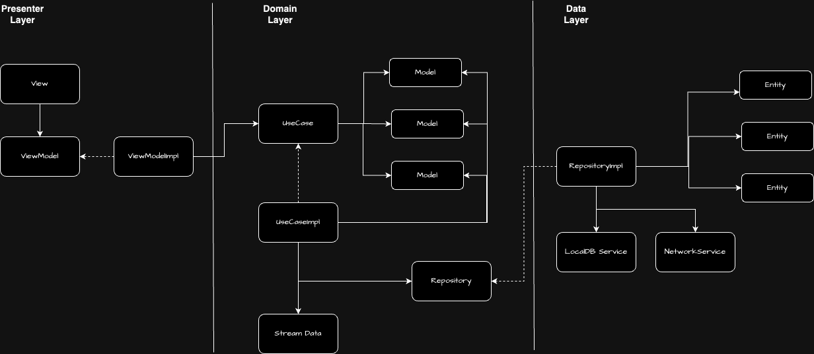
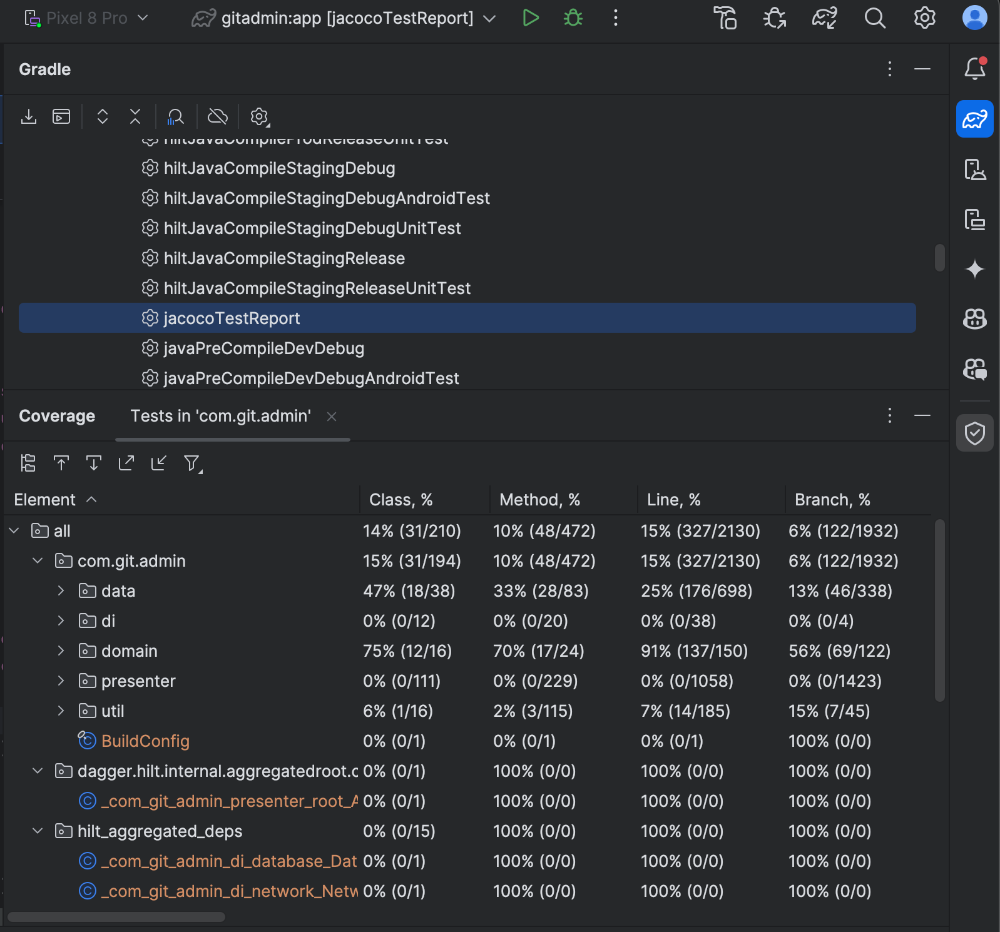
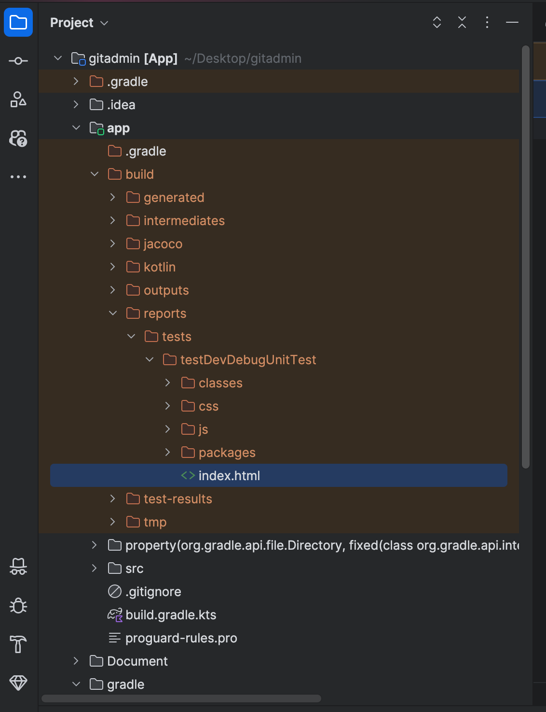
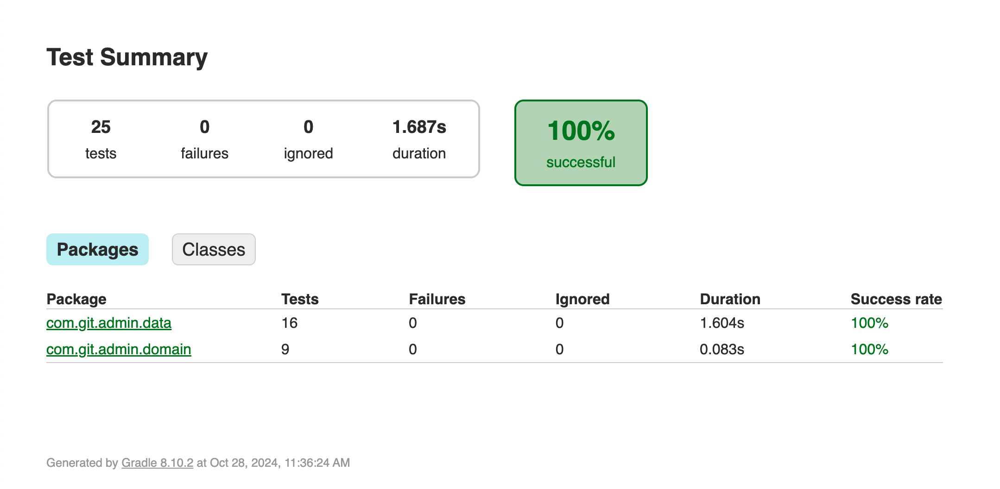

# Git administrator

## Table of Contents
[1. Technical](#technical)
[2. Architecture](#architecture)
[3. Unit test](#unittest)
- [a. Run Unit tests](#rununittests)
- [b. Unit test report](#unittestreport)
- [c. View Unit test report](#viewunittestreport)
- [d. TODO](#todo)

## 1. Technical
	- Implement the project using `Clean Architecture` principles.
	- Utilize Android `Jetpack Compose` for building the user interface.
	- Employ `Kotlin Coroutines Flow` to manage data flow.
	- Use `Dagger` for dependency injection.
	- Integrate `Android Room` for local database management.
	- Apply `MockK` and `JUnit` for unit testing.
	- Utilize `JaCoCo` to generate unit test coverage reports.

## 2. Architecture
### a. Overview

### b. Description
#### App adopts Clean Architecture with three layers:

- `Presenter layer`: Responsible for managing the UI/UX of the application using the MVVM architecture.
- `Domain layer`: Manages the business logic of the application.
- `Data layer`: Handles data requests to the network, storage to local database, etc.
`Presenter layer` ONLY has access to the `Domain layer`, and the `Domain layer` ONLY has access to the `Data layer`.

#### Presenter layer

- Utilizes MVVM architecture.
- Employs SwiftUI for building layouts.
- Uses Combine for binding data to render layouts.

#### Domain layer

- Defines `UseCase` as the protocol to specify all connections from the Presenter layer.
- Defines `UseCaseImpl` as an implementation object to handle business logic for these use cases.
- The `Model` represents the object ready for use in logic and presentation to layouts in the Presenter layer.
- The `Stream data` manages reactive stream data for all application logic.
- The `Repository` is the protocol that defines all connections from the Domain layer.

#### Data layer

- `RepositoryImpl` serves as the implementation object to handle data requests from the Domain Layer.
- `Entity` represents raw objects fetched from network services or local database services, etc.
- `NetworkService` manages all requests to network APIs.
- `LocalDBService` manages storing/getting/updating user data to the local disk.

## 3. Unit test
### a. Run Unit tests
Open `Gradle Tool` on the right side of the Android Studio IDE (see screenshot below) and double click on it

### b. Unit test report
Find the Unit test report at the path `build/reports/tests/testDevDebugUnitTest/index.html` (see screenshot below)

### c. View Unit test report
Open the file `index.html` above to see the report detail. 
The screenshot below is the result

### d. TODO
- Currently, we implement unit test to cover the `Domain` and `Data` layer to cover logic of our code. 
- However, We still need to add more unitest for
    + `ViewModel`: Test the coordination logic and state management of the ViewModel without relying on the UI. Ensure that UI states (such as loading, success, error) are updated correctly.
    + `Mapper (Entity/DTO Mappers)`: Ensure that mappers accurately convert data between different classes (Entity, DTO, Model). Mappers are crucial when data can be in various formats across layers.
    + `Data Sources`: When using multiple data sources (API, Database, Cache), ensure that the data retrieval logic in this layer is accurate. These components should be tested independently if they contain significant processing logic.